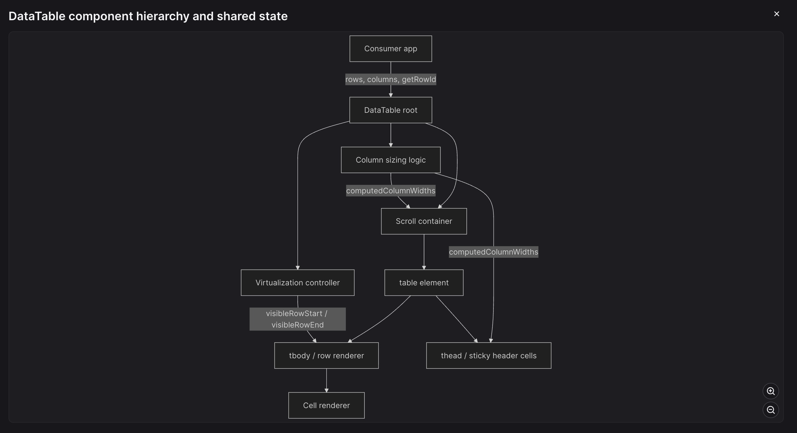
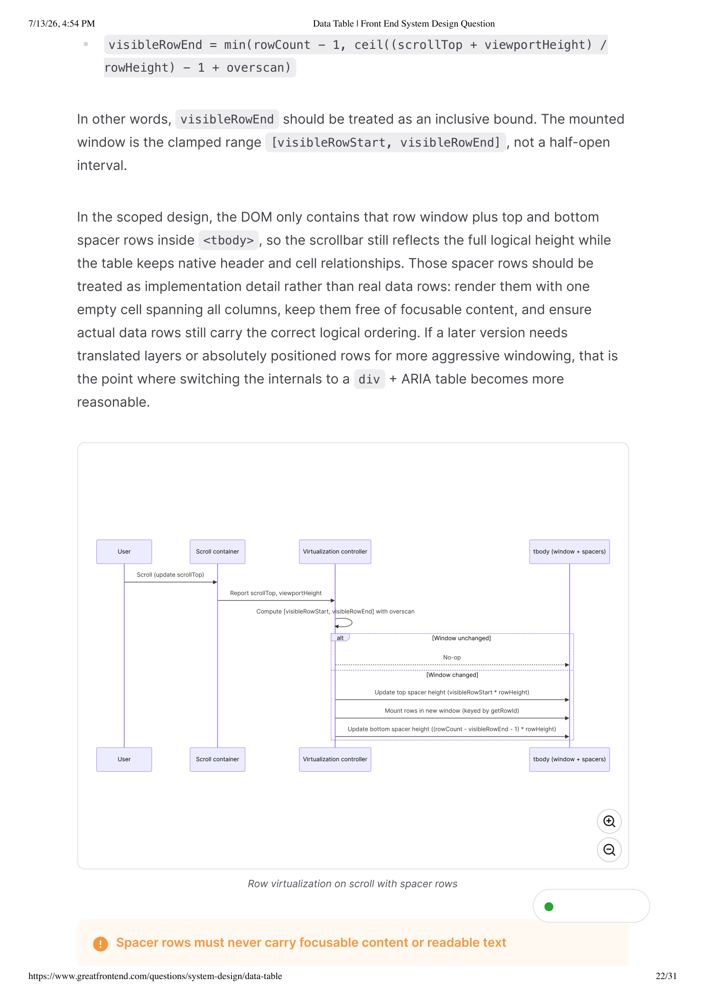

# Data Table

> **Front End System Design Question**
>
> Source: GreatFrontEnd  
> Difficulty: Medium  
> Time: 30 mins  
> Asked at: Meta, Palantir, Dropbox, Stripe  
> Source URL: https://www.greatfrontend.com/questions/system-design/data-table
>
> This document is a cleaned, digestible transcription of the supplied 31-page PDF. The original substance, examples, API definitions, algorithms, accessibility guidance, diagrams, references, and follow-up extensions are preserved. Repeated browser/page chrome is omitted where it does not add content.

---

## 1. Question

Design a reusable, client-rendered data table component for a large web application.

The table should support:

- A fixed header
- Scrollable rows and columns
- Declarative column definitions
- Cells that can render different kinds of data such as strings, numbers, dates, and images

Assume the table is used primarily for reading and scanning tabular data rather than spreadsheet-style editing.

Unlike the Google Sheets system design article, this question is about designing a reusable table component for a shared component library, not formulas, collaboration, or spreadsheet-style cell editing semantics.

### Real-life examples

- TanStack Table
- MUI Data Grid
- AG Grid
- Ant Design Table

---

# 2. Requirements

The component should:

1. Be generic enough to reuse across multiple product surfaces.
2. Keep the header visible while rows scroll vertically.
3. Support horizontal scrolling when there are many columns or when columns cannot shrink further.
4. Allow columns to be configured declaratively and cells to support custom rendering.
5. Accept an optional outer viewport/container width while still producing sensible default column widths.
6. Perform well with large datasets such as thousands of rows.

Focus on the base table design first. Features such as sorting, filtering, column resizing, and fixed columns can be discussed as extensions if time permits.

---

# 3. Requirements exploration

Data tables show up everywhere in modern web applications:

- Admin dashboards
- Analytics views
- Internal tools
- Moderation queues
- Billing pages
- CRMs

A good solution should balance component API design with practical frontend concerns such as:

- Layout
- Semantics
- Sizing
- Rendering performance

## 3.1 What is the primary usage model?

This table is meant for scanning tabular data across:

- Internal tools
- Admin dashboards
- Moderation queues
- Billing pages
- CRM-style surfaces

The basic design should optimize for display, readability, and reuse across product surfaces rather than spreadsheet-style editing or highly interactive cell-by-cell workflows.

## 3.2 What kinds of data and customization should the table support?

Columns should be defined declaratively by the consumer.

Each column should be able to render a consistent cell type across the whole column.

The base component should handle common data such as:

- Strings
- Numbers
- Dates
- Images

Consumers should also be able to supply custom renderers for richer content such as:

- Links
- Badges
- Avatars
- Status pills

Column-level configuration should include at least:

- Header label
- Accessor logic
- Alignment
- Sizing constraints

This is an important clarification because a reusable table component is more naturally configured per column than per individual cell. That keeps the API predictable and makes the component easier to reuse across a shared component library.

## 3.3 What scrolling and sizing behavior is expected?

The header should remain visible while rows scroll vertically.

The table should support horizontal scrolling when the total column width exceeds the available viewport.

By default, columns should use sensible best-fit widths instead of requiring every width to be hard-coded up front.

The component should also accept an optional overall width, which means the design needs a deterministic strategy for:

- Shrinking columns
- Expanding columns
- Truncating columns when space is constrained

For large-data mode, assume the table renders inside a bounded-height viewport rather than growing to fit every row.

The width behavior is one of the main design challenges in this problem. Cover both:

- The unconstrained case
- The constrained-width case

Do not just leave sizing to "whatever the browser does".

## 3.4 What scale should the basic design support?

The basic design should comfortably handle:

- Thousands of rows
- Dozens of columns

It is reasonable to start the architecture by assuming the caller already has the row data in memory, then discuss how the rendering model should change once:

- The dataset becomes too large to mount all rows at once
- Rows are incrementally loaded

That means smooth scrolling and predictable layout are non-functional requirements, not nice-to-haves.

The component should be designed so that large datasets do not:

- Explode the DOM tree
- Make scrolling janky

## 3.5 What devices and accessibility expectations should guide the first version?

Desktop browsers should be the priority because dense tabular data is most commonly consumed there.

The design should still be responsive enough to avoid breaking on smaller screens, but a mobile-first dense table experience is not the main target.

Accessibility should be treated as a base requirement, not an extension.

Because this is a read-heavy tabular surface, the proposed design should preserve:

- Semantic table behavior
- Clear header-to-cell relationships

## 3.6 What is explicitly out of scope for the basic design?

- Inline editing and spreadsheet-like keyboard navigation
- Formulas, computed cell dependencies, and collaboration semantics
- Frozen columns, tree rows, grouped rows, and merged-cell layouts
- Server-driven sorting, filtering, and pagination protocols
- Canvas rendering as the default implementation

Common table features such as:

- Sorting
- Filtering
- Column resizing
- Row selection
- Summary footers

are worth acknowledging, but should be treated as follow-up extensions unless the interviewer asks to prioritize them.

---

# 4. Architecture / high-level design

For the scoped version of this problem, the architecture should stay mostly on the client.

The consumer passes:

- Row data
- Declarative column definitions

into a reusable `DataTable` component.

The table is responsible for:

- Sizing columns
- Rendering cells
- Managing scroll state
- Switching between full rendering and a virtualized body when the dataset is large enough to justify it

## 4.1 Rendering model: semantic table by default

The most important architectural decision is the rendering model.

For a read-heavy table, the best default is a semantic table-based design rather than a spreadsheet-style grid.

Native table semantics already match how assistive technologies expect tabular data to be exposed, and they align with the problem statement better than a fully custom `div`-based layout.

### Default to semantic `<table>` markup over a `<div>`-based grid

For a read-heavy tabular surface, native:

- `<table>`
- `<thead>`
- `<tbody>`
- `<tr>`
- `<td>`

elements give correct accessibility semantics and header-to-cell relationships for free.

A `<div>`-based grid has to recreate all of that behavior manually with ARIA, and is only worth the cost once the component becomes interactive enough to need:

- Managed focus
- Spreadsheet-style keyboard navigation

## 4.2 Example React usage

```tsx
<DataTable
  rows={users}
  columns={[
    { key: 'name', header: 'Name', accessor: (row) => row.name },
    {
      key: 'joinedAt',
      header: 'Joined',
      accessor: (row) => row.joinedAt,
      renderCell: (value) => formatDate(value),
    },
    {
      key: 'avatar',
      header: 'Avatar',
      accessor: (row) => row.avatarUrl,
      renderCell: (value, row) => (
        
      ),
    },
  ]}
  getRowId={(row) => row.id}
  aria-label="Users"
  height={600}
  width={960}
/>
```

This shape keeps the component reusable across product surfaces.

- Rows are plain data.
- Columns define how that data should be interpreted.
- Custom rendering remains a per-column concern rather than an ad hoc per-cell escape hatch.

---

# 5. Markup approach and tradeoffs

There are two realistic markup directions.

### 1. Native `<table>`

Better default semantics, simpler header-to-cell relationships, and a more natural fit for read-heavy tabular content.

### 2. Custom `div`-based layout with ARIA roles

More control over custom layout and virtualization, but significantly more accessibility and focus behavior has to be recreated manually.

The recommended starting point is native table semantics.

In the scoped version of this problem, that recommendation should stay true even when row virtualization is enabled:

- Render the visible rows
- Render top and bottom spacer rows
- Keep them inside the same `<tbody>`

This allows the component to keep:

- One real table
- One sticky header
- One scroll container

A `div` or grid-style implementation becomes more appropriate only once the component needs:

- Absolutely positioned rows
- Spreadsheet-like keyboard navigation
- Cell editing
- Aggressive two-axis virtualization

In an interview setting, those tradeoffs are follow-up material rather than the default architecture.

## 5.1 Simplified native structure

```html
<div class="table-scroll-container" style="overflow: auto;">
  <table>
    <caption>Users</caption>
    <thead>
      <tr>
        <th scope="col">Name</th>
        <th scope="col">Joined</th>
        <th scope="col">Status</th>
      </tr>
    </thead>
    <tbody>
      <tr>
        <td>Ada Lovelace</td>
        <td>Jan 3, 2024</td>
        <td>Active</td>
      </tr>
    </tbody>
  </table>
</div>
```

This example is intentionally simple, but it makes the structure explicit:

- The scrollbars belong to the outer scroll container.
- The inner table preserves the semantic relationship between headers, rows, and cells.

The `div` route is still worth acknowledging as a fallback path.

- `role="table"` fits a mostly read-only surface that needs more layout control than native tables provide.
- `role="grid"` becomes appropriate only once the component is interactive enough to require managed focus and directional keyboard navigation.

If the internals ever move away from native table flow, metadata such as:

- `aria-rowcount`
- `aria-colcount`
- `aria-rowindex`
- `aria-colindex`

may be needed to preserve accessibility.

That is a later escalation point, not the recommended starting architecture.

---

# 6. Scroll and sticky-header strategy

The table should render inside one bounded scroll container that owns both:

- Vertical overflow
- Horizontal overflow

The header row stays visible by using sticky positioning relative to that container, while the body rows scroll underneath it.

The important architectural choice is to keep one shared scroll surface rather than splitting the header and body into separate scroll surfaces.

This avoids:

- Scroll-sync bugs
- Duplicated width calculations
- Alignment drift

## 6.1 Bounded-height behavior

Sticky headers and row virtualization only make sense when the component has a real vertical viewport.

Therefore:

- `height` should be treated as required for scrollable mode.
- If `height` is omitted, the table can still render as a plain non-virtualized table that grows naturally.
- Fixed-header behavior is inactive when there is no containing scroll surface for `position: sticky` to latch onto.

It is also important to distinguish:

- **Scroll viewport width**
- **Resolved table content width**

The optional `width` prop should size the outer scroll container.

The inner table may still resolve to a wider width and overflow horizontally if its columns cannot shrink any further.

## 6.2 Do not split the header and body into separate scroll surfaces

A shared scroll container with a sticky `<thead>` is the simpler and more robust default.

Two separate scroll surfaces require manual scroll synchronization on every scroll event.

Any hiccup shows up as visibly drifting column alignment, exactly the kind of bug that is hard to debug in production and that you can avoid by letting one container own both axes.

---

# 7. Component responsibilities

| Component | Role |
|---|---|
| `DataTable` root | Accepts external props, resolves static versus virtualized-body layout mode, owns derived scroll and sizing state, and coordinates the subcomponents. |
| Scroll container | Defines the bounded viewport and handles both horizontal and vertical scrolling. |
| Header row / header cells | Render column labels, expose header semantics, and remain visible with sticky positioning. |
| Row renderer | Renders the visible rows using stable row identity. |
| Cell renderer | Applies the default or custom renderer for each column while preserving alignment and overflow rules. |
| Virtualization controller | Determines which rows should be mounted based on the viewport and overscan window, and inserts spacer rows when native-table virtualization is active. |
| Column sizing logic | Computes default widths, applies explicit min/max constraints, handles constrained-width redistribution, and exposes one shared width map to the header and body. |

The result is a relatively simple architecture:

- Semantic table surface
- Shared column sizing model
- One scroll container
- Virtualization layer

The virtualization layer can reduce DOM cost without changing the table's external API.

## 7.1 Architecture diagram



**Diagram concept:** Consumer inputs such as rows and columns feed the `DataTable`, which coordinates column sizing, virtualization, scrolling, the table body/rows, the sticky header, and cell rendering. Computed column widths and visible-row state are shared derived values.

---

# 8. Data model

For a reusable data table component, the data model is a mix of consumer-provided inputs and internally derived layout state.

The table should not mutate the caller's row data.

Instead, it should:

1. Treat input rows and column definitions as the source of truth.
2. Derive sizing, scrolling, and virtualization state from them.

## 8.1 Core external data structures / config / props

The two most important external structures are:

- Row collection
- Column definition model

Columns are first-class configuration objects, not something inferred ad hoc from the first row of data.

That makes the component much easier to reason about across a large codebase.

### `ColumnDef<Row>`

```tsx
type ColumnDef<Row> = {
  key: string;
  header: ReactNode | ((column: ColumnDef<Row>) => ReactNode);
  accessor: (row: Row) => unknown;
  renderCell?: (value: unknown, row: Row) => ReactNode;
  width?: number;
  minWidth?: number;
  maxWidth?: number;
  align?: 'start' | 'center' | 'end';
  overflow?: 'truncate' | 'clip' | 'wrap';
};
```

## 8.2 Core internal state

| State | Type | Description |
|---|---|---|
| `rowIds` | `string[]` | Stable row identities derived from `getRowId`, used for rendering and virtualization. |
| `computedColumnWidths` | `Map<string, number>` | Final resolved width for each column after applying defaults and constraints. |
| `scrollLeft` | `number` | Horizontal scroll offset of the scroll container. |
| `scrollTop` | `number` | Vertical scroll offset of the scroll container. |
| `viewportWidth` | `number` | Visible width of the scroll container. |
| `viewportHeight` | `number` | Visible height of the scroll container. |
| `visibleRowStart` | `number` | Index of the first mounted row in the current viewport window. |
| `visibleRowEnd` | `number` | Inclusive index of the last mounted row in the current viewport window. |

The table may also keep lightweight UI state for:

- Loading
- Empty presentation
- Error presentation

But the key state for this design problem is layout-oriented rather than data-mutating.

## 8.3 Derived state and layout metadata

Not every value needs to be stored explicitly.

Important derived values include:

- Total logical row count
- Total scrollable body height
- Natural table width before any constrained-width redistribution
- Total resolved table width after grow/shrink logic
- Whether horizontal overflow is active
- Whether virtualization should be enabled for the current dataset size
- Resolved overflow behavior for each column after applying defaults and virtualization constraints

Treating these as derived values keeps the component easier to reason about and reduces the risk of duplicated state getting out of sync.

### Data-model diagram


---

# 9. Row height model

The basic design should assume a **fixed row height**.

This keeps viewport math straightforward because the visible window can be calculated from:

- `scrollTop`
- `rowHeight`
- `viewportHeight`
- `overscan`

without measuring every mounted row.

Variable-height rows are possible, but they push the design into a different complexity tier.

Once row heights depend on rendered content, the table needs:

- Measurement logic
- Cached row metrics
- More complicated virtualization behavior

For these reasons, variable row heights are better treated as an extension rather than part of the base architecture.

## 9.1 Overflow implications

The fixed-row-height assumption also affects content overflow behavior.

In the fixed-row-height base design, virtualized rows should default to:

- Single-line truncation
- Clipping

Multi-line wrapping fits better in:

- Non-virtualized mode
- Variable-row-height mode

The base design should not claim to support `wrap` together with fixed-height virtualization unless it is also willing to measure row heights dynamically.

---

# 10. Interface definition (API)

The API should make the happy path obvious:

1. Pass in rows.
2. Declare columns.
3. Provide a stable row identity.
4. Optionally configure viewport and sizing behavior.

A good table API should feel reusable across many product surfaces without requiring every consumer to understand the component's internal virtualization or layout machinery.

## 10.1 Core API

| Prop | Type | Description |
|---|---|---|
| `rows` | `Row[]` | Source data for the table. |
| `columns` | `ColumnDef<Row>[]` | Declarative column definitions that control headers, accessors, renderers, and sizing. |
| `getRowId` | `(row: Row) => string` | Returns a stable identity for each row. Important for rendering, virtualization, and any row-level interactions. It serves a similar purpose to `key` in React. |
| `height` | `number \| string` | Bounded viewport height. Required when the caller wants vertical scrolling, a sticky header, or row virtualization. If omitted, the table grows naturally and those behaviors stay off. |
| `width` | `number \| string` | Optional width of the outer scroll viewport. The resolved inner table can still be wider than this value, in which case horizontal scrolling remains enabled. |
| `rowHeight` | `number` | Fixed row height used by the basic design. |
| `overscan` | `number` | Number of extra rows to render above and below the viewport when virtualization is enabled. |
| `caption` | `ReactNode` | Optional visible table caption. Preferred when the design supports a visible accessible name. |
| `aria-label` / `aria-labelledby` | `string` | Accessible naming hooks when a visible caption is not appropriate or when the name should come from surrounding UI. |
| `loading` | `boolean` | Whether the table is currently in a loading state. |
| `emptyState` | `ReactNode` | Content shown when there are no rows to display. |
| `errorState` | `ReactNode` | Content shown when the table cannot render normally because of an error or failed load. |

The base table should accept a plain list of row records.

That mirrors how product code usually models server data already, so the component can drop into many surfaces without forcing consumers to reshape everything first.

### Important sizing distinction

`width` controls the **viewport**, not the sum of the column widths.

The component still computes a separate resolved table width from the column model, then compares that content width against the viewport to decide whether to:

- Grow columns
- Shrink flexible ones
- Keep horizontal overflow

## 10.2 Example consumer-facing API

```tsx
<DataTable
  rows={users}
  columns={[
    {
      key: 'name',
      header: 'Name',
      accessor: (row) => row.name,
      minWidth: 180,
    },
    {
      key: 'joinedAt',
      header: 'Joined',
      accessor: (row) => row.joinedAt,
      renderCell: (value) => formatDate(value),
      width: 140,
      align: 'end',
    },
  ]}
  getRowId={(row) => row.id}
  aria-label="Users"
  height={600}
  width={960}
  rowHeight={44}
  overscan={8}
/>
```

## 10.3 Columns as a single array make reordering trivial

One of the greatest strengths of this design is that columns can be added or removed easily.

You only need to:

1. Modify the contents of the array passed into the `columns` prop.
2. Ensure that the row contains data accessed by that column.

Other approaches that separate header and body cell definitions do not enjoy this benefit.

---

# 11. Column API details

Each column definition should expose a small but expressive set of fields.

### `key`

Stable identifier for the column.

### `header`

Header label or custom header renderer.

### `accessor`

Function that extracts the value for that column from a row.

### `renderCell`

Optional custom renderer for richer presentation.

### `width`

Preferred width when the consumer wants to opt into explicit sizing.

This is especially useful for non-text columns such as:

- Avatars
- Thumbnails
- Action cells

where the ideal width is hard to infer from raw data alone.

### `minWidth` / `maxWidth`

Constraints for the sizing algorithm.

### `align`

Horizontal alignment for the cell content.

### `overflow`

Overflow policy for the column.

In the fixed-row-height virtualized base design:

- `truncate` or `clip` should be the default.
- `wrap` is a better fit for non-virtualized or variable-height mode.
- The simplest base policy is to disable virtualization when wrapping is required.

This keeps the API aligned with how engineers actually think about tables.

Most customization happens per column, not at the level of individual cell instances.

## 11.1 Optional extension points

It is reasonable to leave room for common extensions without making them mandatory in the base API:

- `onRowClick`
- `sortField`
- `onSortChange`
- `renderFooter`
- `className` or slot-level styling hooks for the root, header, rows, and cells

These are intentionally optional.

The base component should not force every consumer to think about:

- Sorting
- Row actions
- Footers

if all they need is a performant read-heavy table.

## 11.2 API design notes

Prefer a small, composable API over a huge prop surface.

In particular:

- Keep the data contract centered on `rows`, `columns`, and `getRowId`.
- Keep sizing explicit enough to be predictable, but not so verbose that every column requires manual tuning.
- Make the accessibility contract explicit by supporting a visible caption and pass-through naming props such as `aria-label` and `aria-labelledby`.
- Keep advanced behavior as additive extension points instead of making the base API feel like a kitchen sink.

There is also a real API tradeoff worth calling out.

A component library could expose a more markup-like composition API such as:

```tsx
Table
Table.Head
Table.Body
Table.Row
Table.Cell
```

That can feel nicely declarative, but it is usually more verbose and often pushes every consumer into building the row-mapping layer themselves.

For a reusable product table, a `rows` plus `columns` contract is usually the more pragmatic default.

Designing good customization surfaces for reusable UI primitives follows the same general principles discussed in the Front End Interview Guidebook's UI Components API Design Principles Section.

The source recommends checking out **TanStack Table**, which is a very good example of a headless table library API.

---

# 12. Optimizations and deep dive

This section discusses production extensions that commonly follow the base table design, especially when datasets become large and cells become more customized.

Topics:

1. Width allocation and layout
2. Sticky header implementation details
3. Row virtualization
4. Column virtualization
5. Accessibility
6. Rich cell content
7. Further extensions

---

# 13. Width allocation and layout

Column sizing is one of the hardest parts of this problem because the component has to support two different modes:

### Natural width mode

The table width is unconstrained.

### Constrained width mode

The scroll viewport is bounded and the column model may need to redistribute space.

To keep behavior predictable, the component should track two separate values:

- `viewportWidth`: the visible width of the scroll container, derived from layout or the optional `width` prop.
- `naturalTableWidth` / `resolvedTableWidth`: the width implied by the column model before and after redistribution.

## 13.1 Practical sizing algorithm

### Step 1

Start with any explicit width values supplied by the consumer.

### Step 2

For columns without explicit widths, estimate a preferred width from:

- Header text
- A representative sample of cell contents

### Step 3

Clamp every preferred width by `minWidth` and `maxWidth`.

### Step 4

Sum the preferred widths to get the natural table width.

## 13.2 Avoid scanning the full dataset

Step 2 should avoid scanning the full dataset.

A better policy is to combine:

- Header width
- A small sample of representative rows

or measure cell width in a hidden sizing layer, such as an offscreen DOM element.

Measuring every rendered value would be too costly.

Constantly recalculating and adjusting widths during scroll is definitely undesirable.

## 13.3 Custom renderer sizing

Custom renderers need an extra rule.

For text-like content, sampling the accessor output is often good enough.

For richer cells such as:

- Avatars
- Badges
- Links with icons
- Action menus

the raw value is not a reliable proxy for rendered width.

In those cases, the component should either:

1. Calculate an estimated width during the initial sizing pass, or
2. Expect the consumer to provide `width` or `minWidth`.

That keeps rich cells predictable without requiring the table to inspect every mounted instance.

## 13.4 Resolve against the viewport

Once the natural width is known, compare it against the viewport width.

### If the viewport is larger

Distribute the extra space across flexible columns.

### If the viewport is smaller

Shrink flexible columns proportionally until they hit `minWidth`.

### If the table is still wider

If the table is still wider than the viewport after all shrinkable columns reach `minWidth`, keep horizontal scrolling instead of over-compressing the content.

This is important.

A table should not pretend it can always fit by making every column unreadably narrow.

It is usually better to preserve legibility and allow horizontal overflow than to crush the layout.

## 13.5 Consider Pretext for cheap multiline text measurement

Pretext is a modern library for multiline text measurement and layout.

It sidesteps the need for DOM measurements by implementing its own text measurement logic, using the browser's own font engine as ground truth.

It can be used to cheaply calculate width for contents.

---

# 14. Column width resolution pipeline

Late-arriving rows introduce another subtle tradeoff.

If the table keeps recomputing widths whenever new data appears, the columns will visibly jump around.

A steadier default is to:

1. Size from headers plus an initial sample.
2. Let unusual outliers follow the column's overflow policy instead of immediately forcing a remeasure.

In the base design, remeasurement can stay an internal policy that runs only when:

- The column model changes
- The viewport changes materially
- The implementation deliberately performs a new sizing pass

Once the component supports explicit constraints and virtualization, application-managed sizing is easier to reason about than relying entirely on the browser's auto table layout.

The browser is still useful for basic table behavior, but the sizing policy should live in the component's column model.

After the widths are resolved, they should be applied through one shared mechanism rather than allowing the header and body to size themselves independently.

In native table mode, a `<colgroup>` is a clean way to publish the `computedColumnWidths` map so that both `<thead>` and `<tbody>` follow the same column model.

In that mode, `table-layout: fixed` is usually the better companion once the component owns the width map, because it makes:

- Truncation
- Sticky-header alignment
- Virtualization behavior

more deterministic.

Browser auto layout is still reasonable for a simpler non-virtualized table that mostly defers sizing to content, but it should not be the primary strategy once the component is doing explicit width allocation.

If the implementation later switches to a `div` + ARIA table, that same width map can drive a shared `grid-template-columns` or explicit inline widths.

The key idea is that header and body alignment come from one authoritative width source.

### Column width resolution diagram


---

# 15. Sticky header implementation details

The architecture already chose one bounded scroll container.

At implementation time, the main concerns are:

- Sticky positioning
- Visual layering

Header cells can use:

```css
position: sticky;
top: 0;
```

plus an explicit background color and `z-index` so scrolling rows do not bleed through visually.

If the design uses borders or shadows to separate the header from the body, those should stay attached to the sticky header cells so the boundary remains visible during scroll.

## 15.1 Resize handling

When the viewport changes, the component should:

1. Run one sizing pass.
2. Publish the updated widths through the shared column model.

This keeps the sticky header and scrolling body aligned.

This is another reason to avoid separate header and body scrollers unless the design has already outgrown the native-table architecture.

---

# 16. Row virtualization

For datasets with thousands of rows, **row virtualization is the main optimization**.

The core idea is the same as in Autocomplete:

> Render only the visible window plus a small overscan buffer instead of mounting the whole dataset.

With fixed row height, the visible window can be computed cheaply.

## 16.1 Visible-row calculation

```ts
visibleRowStart =
  Math.max(
    0,
    Math.floor(scrollTop / rowHeight) - overscan
  );
```

The end index is:

```ts
visibleRowEnd =
  Math.min(
    rowCount - 1,
    Math.ceil((scrollTop + viewportHeight) / rowHeight) - 1 + overscan
  );
```

`visibleRowEnd` should be treated as an **inclusive bound**.

The mounted window is the clamped range:

```text
[visibleRowStart, visibleRowEnd]
```

not a half-open interval.

## 16.2 Pair the column width map with `table-layout: fixed`

Once the component computes explicit column widths, `table-layout: fixed` makes rendering **O(columns) per row** instead of letting the browser scan content to decide widths.

That is what keeps:

- Sticky-header alignment
- Virtualized row insertion
- Truncation behavior

consistent at scale.

Auto layout can silently diverge from the shared width map as new rows mount.

## 16.3 Spacer rows

In the scoped design, the DOM only contains:

- The row window
- Top spacer row(s)
- Bottom spacer row(s)

inside `<tbody>`.

This means:

- The scrollbar still reflects the full logical height.
- The table keeps native header and cell relationships.

Spacer rows should be treated as implementation detail rather than real data rows.

Render them with:

- One empty cell spanning all columns
- No focusable content
- No readable text

Actual data rows should still carry the correct logical ordering.

If a later version needs translated layers or absolutely positioned rows for more aggressive windowing, that is the point where switching the internals to a `div` + ARIA table becomes more reasonable.

### Row virtualization flow



The flow is:

1. User scrolls the container.
2. The scroll container reports `scrollTop` and `viewportHeight`.
3. The virtualization controller computes `[visibleRowStart, visibleRowEnd]` with overscan.
4. If the window is unchanged, do nothing.
5. Update top spacer height:

```text
visibleRowStart * rowHeight
```

6. Mount rows in the new window, keyed by `getRowId`.
7. Update bottom spacer height:

```text
(rowCount - visibleRowEnd - 1) * rowHeight
```

Spacer rows must never carry focusable content or readable text.

---

# 17. Virtualization performance details

Virtualization keeps the number of mounted row nodes proportional to viewport size instead of dataset size.

It also makes the performance discussion concrete:

- Stable row identities prevent unnecessary remounts.
- Fixed row height keeps the math cheap.
- Overscan prevents flashes of empty content during fast scrolling.
- Lightweight cell renderers keep scrolling smooth.

Virtualization reduces DOM size, but it does **not** automatically prevent expensive rerenders.

In a React implementation:

- Scroll state and viewport calculations should stay localized to the table controller.
- Visible rows and cells should receive stable inputs whenever possible.
- Stable column definitions can help.
- Lightweight formatter functions can help.
- Memoized row or cell subtrees can help.

These practices keep scroll work proportional to the visible window rather than redoing unnecessary work across every mounted cell.

## 17.1 Data fetching boundary

In interviews, it is usually fine to assume the data has already been fetched and is handed directly to the component.

If a real product later needs:

- Side-loading
- Server pagination
- Infinite loading

the same `rows` and `columns` contract can remain intact while fetching stays outside the table itself.

That keeps the primitive reusable instead of binding it to one transport pattern.

---

# 18. Do not key rows by array index in a virtualized table

Use the stable identity returned by `getRowId` as the React key.

Index-based keys cause rows to get reconciled to a different underlying record as the window shifts during scroll.

This can:

- Break row-local state
- Defeat memoization
- Produce subtle visual glitches where cell content lags behind the intended row

---

# 19. Column virtualization

Column virtualization is a valid follow-up optimization, but it should not be the base recommendation.

In most product tables:

> Row count becomes a problem much earlier than column count.

Column virtualization also adds cost:

- Header and body alignment get trickier.
- Keyboard navigation and accessibility metadata become harder to maintain.
- Sticky regions and future fixed-column support become more complex.

If the interviewer pushes on extremely wide surfaces with hundreds of columns, column virtualization becomes more compelling.

That is closer to the tradeoff space in the Google Sheets system design article, where both axes are large enough to justify heavier viewport-related computation logic.

---

# 20. Accessibility

The basic design should keep semantic table behavior.

## 20.1 Semantic headers

Header cells should use proper table header semantics such as:

```html
<th scope="col">
```

## 20.2 Accessible naming

The table should expose a clear accessible name through:

- A visible `caption`
- `aria-labelledby`
- `aria-label`

## 20.3 Loading state

When `loading` is true, the table region or scroll container should expose:

```html
aria-busy="true"
```

so assistive technologies know the content is updating.

## 20.4 Empty and error states

Empty and error states should be announced in a way that makes sense for assistive technology users.

If they replace the body, rendering them as a full-width row with:

```tsx
colSpan={columns.length}
```

preserves table context.

If they are transient status messages, an adjacent live region may be more appropriate.

---

# 21. Table presentation lifecycle

Virtualization adds one important nuance:

> The full dataset may no longer be present in the DOM.

If the implementation stays in native-table mode by using spacer rows inside `<tbody>`:

- Header associations remain straightforward.
- Spacer rows must not behave like meaningful data rows to assistive technologies.

Spacer rows should be:

- Empty
- Non-interactive
- Layout artifacts

Mounted data rows should preserve the expected reading order and, if necessary, expose logical indices.

If browser and screen-reader testing shows that spacer rows still create confusing row navigation, that is a good reason to switch the internal implementation to a `div` + ARIA table or grid structure.

In that mode, metadata such as:

- `aria-rowcount`
- `aria-colcount`
- `aria-rowindex`
- `aria-colindex`

becomes more important so that assistive technologies still understand:

- The logical table size
- The position of each visible row

The article should also be explicit that:

```html
role="grid"
```

is **not the default**.

It becomes appropriate only when the table is meaningfully interactive and needs composite-widget keyboard behavior.

### Table presentation lifecycle diagram


---

# 22. Rich cell content

Column renderers add support for mixed content types, but a few default layout rules should be established.

### Text-heavy columns

Use an explicit overflow policy instead of overflowing unpredictably.

In the fixed-row-height virtualized base design:

- Truncation is safer.
- Clipping is safer.
- Multi-line wrapping fits better in non-virtualized or variable-height mode.

### Numeric and date columns

These often read better when aligned consistently.

### Image cells

Use constrained thumbnails or avatars so they do not blow up row height.

### Rich non-text cells

These usually need either:

- Offscreen DOM measurements, or
- Explicit width constraints

so the sizing algorithm does not guess from raw values.

### Custom renderers

Custom renderers should be lightweight and predictable because they sit in the hot rendering path during scrolling.

---

# 23. Further extensions

Other practical follow-up features that teams usually want but are typically out of scope for interviews:

- Sorting
- Filtering
- Paginated data
- Column resizing
- Sticky/frozen columns
- Sticky footers
- Row actions or row selection

These features are compatible with the overall architecture, but they should layer on top of the same core design:

- Declarative columns
- One shared sizing model
- One scroll container
- Virtualization that is primarily row-oriented

---

# 24. Summary

## Core scope

Scope `DataTable` as a reusable, read-heavy component.

It turns:

- `rows`
- Declarative `columns`
- A stable `getRowId`

into a semantic, accessible table capable of handling:

- Thousands of rows
- Dozens of columns

Sorting, filtering, pagination, selection, and inline editing stay outside the core contract and attach as additive extensions.

This keeps the default surface small and the performance envelope predictable.

## Keep semantics and column configuration in the core contract

Native:

- `<table>`
- `<thead>`
- `<tbody>`

markup lives inside a single bounded scroll container.

The browser handles semantics and alignment for free.

`ColumnDef<Row>` concentrates per-column concerns like:

- `accessor`
- `renderCell`
- Width constraints
- `overflow`

into one configuration object.

## Share one width contract between header and body

The column model feeds a `computedColumnWidths` pipeline that:

1. Resolves explicit widths.
2. Estimates the rest from headers plus a small sample.
3. Clamps against min and max bounds.
4. Distributes remaining space.

Publishing the result through a `<colgroup>` paired with `table-layout: fixed` keeps header and body widths from drifting.

## Use row virtualization as the main scale lever

A fixed `rowHeight` and `overscan` derive an inclusive:

```text
[visibleRowStart, visibleRowEnd]
```

window.

Spacer rows preserve scroll height.

`getRowId` keying keeps real rows correctly reconciled by React.

## Let native table semantics carry accessibility until the component becomes interactive

Use:

```html
<th scope="col">
```

on headers.

Use:

```html
aria-busy="true"
```

during loading.

Use full-width `colSpan` rows for empty and error states.

Keep:

```html
role="grid"
```

in reserve for the interactive escalation path.

This keeps the baseline accessible without overcomplicating the default component.

## Recommended interview framing

Start with:

1. Semantic table structure
2. Shared width contract
3. One bounded scroll container
4. Row virtualization as the single major performance lever

That makes the scale target realistic while preserving a small, reusable component API.

---

# 25. References

The references below group data-table sources by the topic they inform, making it easier to map each source back to the part of the article it relates to:

- Accessibility patterns
- Layout and CSS primitives
- Virtualization
- Production data-grid libraries
- Related articles
- Coding questions

## 25.1 Accessibility patterns

This subsection links the canonical ARIA authoring guidance for read-heavy tables versus interactive grids, which underpins the semantics choices in the article.

- **WAI-ARIA APG: table pattern**: accessibility model for read-heavy tabular content.
- **WAI-ARIA APG: grid pattern**: tradeoffs when a table evolves into a more interactive composite widget.
- **React Aria: `useTable`**: accessible table structure and reusable component patterns.

## 25.2 Layout and CSS primitives

This subsection covers the CSS features that sizing, sticky headers, and column widths rely on.

- **MDN: `position`**: sticky positioning behavior within a scroll container.
- **MDN: `table-layout`**: tradeoffs between automatic and fixed table layout.

## 25.3 Virtualization and production data grids

This subsection links the windowing model used by row virtualization along with practical guidance from mature production data-grid libraries.

- **web.dev: virtualize large lists with `react-window`**: core windowing model behind row virtualization.
- **MUI X: data grid - layout**: relationship between bounded container sizing and virtualization.
- **AG Grid: DOM virtualisation**: practical production tradeoffs around viewport rendering.
- **AG Grid: row height**: implications of fixed versus variable row heights on virtualization.

## 25.4 Related system design articles

The articles below overlap with the data table on virtualization and interactive grid surfaces.

- **Collaborative spreadsheet (Google Sheets)**: point where a read-heavy table evolves into a more interactive grid with two-axis virtualization, cell-level semantics, and spreadsheet-style behavior.
- **Autocomplete**: another example where viewport rendering and virtualization become important once the result set grows beyond what should be mounted all at once.

## 25.5 Related coding questions

The coding questions below build up the same column-definition and table-rendering ideas from this system design article in a hands-on format.

- **Data table**: basic rendering and pagination mechanics of a tabular UI.
- **Data table II**: adding column sorting behavior on top of the base table.
- **Data table III**: same column-definition and reusable API ideas discussed in this system design article.
- **Data table IV**: extending the generalized table with per-column filtering.

---

# 26. Source page map

For easier cross-checking against the supplied PDF:

| PDF pages | Main content |
|---|---|
| 1 | Question, real-life examples, requirements |
| 2-4 | Requirements exploration and scope |
| 5-7 | Architecture, semantic table markup, markup tradeoffs |
| 8-9 | Scroll strategy, component responsibilities, architecture diagram |
| 10-12 | Data model, internal state, derived state, row height model, data-model diagram |
| 13-15 | API, consumer-facing API example, column-array design |
| 16-17 | Column API details, extension points, API design notes |
| 18-20 | Width allocation, sizing algorithm, rich-renderer sizing, width pipeline |
| 21-23 | Sticky header, row virtualization, spacer rows, virtualization performance |
| 24-25 | Column virtualization and accessibility lifecycle |
| 26 | Rich cell content and further extensions |
| 27 | Summary |
| 28-29 | References and related questions |
| 30 | GreatFrontEnd Projects sponsor content |
| 31 | Site navigation/footer content |

---

# 27. Note on visual assets

The PDF contains several diagrams that carry architectural/process information:

- DataTable component hierarchy and shared state
- Relationship between consumer inputs, core state, and derived layout
- Column width resolution pipeline
- Row virtualization on scroll with spacer rows
- Table presentation lifecycle

These have been preserved as image assets in the accompanying `data_table_markdown_assets/` directory and embedded above.

The PDF renderer made some page images unavailable during extraction, but the unavailable pages corresponded primarily to text-only pages or pages whose substantive content was already recoverable from the PDF text. No visibly broken source image was identified that requires a replacement upload.

---

# 28. Original source metadata

- Source: GreatFrontEnd
- Title: Data Table | Front End System Design Question
- URL: https://www.greatfrontend.com/questions/system-design/data-table
- PDF length: 31 pages
- PDF capture timestamp shown in the source: 7/13/26, 4:54 PM
- Difficulty shown: Medium
- Estimated interview time shown: 30 mins
- Companies shown: Meta, Palantir, Dropbox, Stripe

The source also displays GreatFrontEnd's surrounding site navigation, including Practice, Guides, Study Plans, Company, Pricing, Promotions, Roadmap, About, Team, Contact, Advertise, Become an affiliate, Careers, Blog, Medium, and DEV Community, plus the 2026 Codeney Pte Ltd copyright notice.
